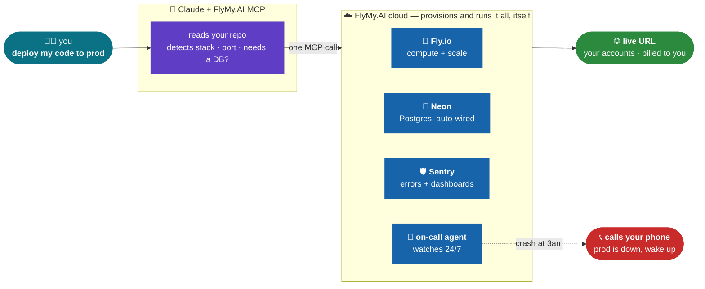

# replifly 🚀

**We killed Replit.** One sentence - *"deploy my code to prod"* - and Claude + the **FlyMy.AI cloud** stand up the whole thing: compute, database, monitoring, and an agent that phones you when it crashes. On **your** accounts, billed to **you**. No subscription, no lock-in.



## vs a $25/mo Replit subscription

|  | Replit | replifly |
|---|---|---|
| Deploy from one prompt | ✅ (Replit Agent) | ✅ (Claude, any model) |
| Where it runs | Replit's cloud, rented | **your Fly.io / Neon**, billed to you |
| Monitoring + error tracking | basic | **Sentry + dashboards, wired in** |
| Wakes you when it crashes | ❌ | ✅ **an agent calls your phone** |
| Lock-in | your app lives on Replit | **you own the stack, portable** |
| Cost | $25/mo + deploy fees | pay-per-use on your own accounts |

## Build it yourself

1. Connect the FlyMy.AI cloud to your agent - one line:
   ```bash
   claude mcp add --transport http flymyai https://mcp-agents.flymy.ai/mcp
   ```
2. In your repo, say it:
   ```
   deploy this repo to prod: Fly.io + a Postgres DB, wire Sentry, and an
   on-call agent that calls me if it goes down.
   ```
3. Claude reads your code, auto-detects the stack, provisions everything through the cloud, and hands you a live URL. See [BUILD_PROMPT.md](BUILD_PROMPT.md) for the exact prompt and [`skill/`](skill/) for the reusable "ship-to-production" skill.

## Receipts

Real end-to-end run (deploying [NocoDB](https://github.com/nocodb/nocodb), an open-source Airtable/CRM), every step through the FlyMy.AI MCP - what worked, what we had to fix, real load numbers - is in [BUILD_LOG.md](BUILD_LOG.md).

---

> **Not affiliated with, endorsed by, or sponsored by Replit, Inc.** "Replit" is a trademark of Replit, Inc., used here only to describe the category. replifly is an independent open-source project.
